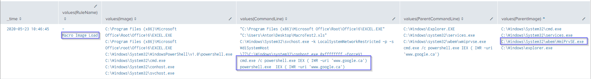
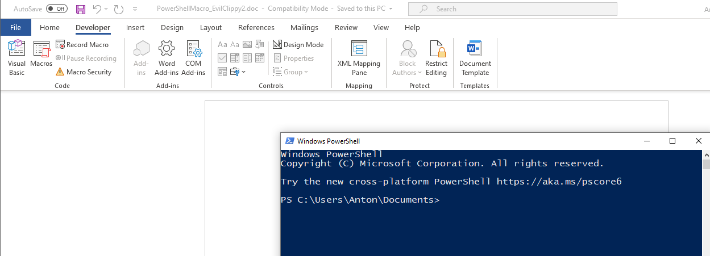

1. [Hunting Malicious Macros](#first)
---

## Hunting Malicious Macros<a name="first"></a>

Taking a look at the MITRE ATT&CK page for malicious macros, it's clear that this technique is a favourite among APT groups. Microsoft Office is indeed ubiquitous in a corporate office setting and presents defenders with a very large attack surface. 

"_Just disable macros_" is a great idea, but many critical business processes run on the back of decades-old macros; for better or for worse.

To get a sense of how widely malicious macros are utilized, take a look at the technique via MITRE: [T1566.001](https://attack.mitre.org/beta/techniques/T1566/001/)

In this post I will cover detection techniques that provide relatively robust coverage for detecting malicious macros in your own environment. I'll be using Sysmon to generate the log data and Splunk to query that data, I'll also highlight some Sigma rules that can help with Macro detections. 

Before I dive in, I need to acknowledge that this work **definitely** stands on the shoulders of giants and I'll be referencing their work heavily throughout. 

### Atomic Red Team

Red Canary have done the defensive world a huge solid and have provided a script that generates macros for you so that detections can be tested, so let's start there:

* [Blog Post](https://redcanary.com/blog/testing-initial-access-with-generate-macro-in-atomic-red-team/)

* [Script Used](https://github.com/redcanaryco/atomic-red-team/blob/master/ARTifacts/Initial_Access/generate-macro.ps1)

`Note: Originally these macro tests download other scripts from the Red Canary repo to do other things with the macro, for the purposes of my testing, however, I only wanted to test the original macro execution so I modified these scripts slightly to just call out to Google instead of running the full blown tests. `

We generate our macro, which outputs an Excel file: 


Now let's take a look at what Sysmon shows us when this macro is executed, using the [SwiftOnSecurity Config](https://github.com/SwiftOnSecurity/sysmon-config/blob/master/sysmonconfig-export.xml)

Using this basic Splunk Query: 

```sql
index=sysmon EventCode=1 Image=*Excel*
| table Image,ParentImage,CommandLine
```
Gives us these results: 


Not very interesting, the typical "Excel has Spawned PowerShell or a Command Prompt" detection has failed here, as these macros use techniques which circumvent this particular detection (More details about this are in the Red Canary Blog post linked above) 

If we observe Excel behaviour through something like Procmon, we can see that Excel loads specific DLLs when a macro is loaded. We can configure Sysmon to look for this type of behaviour.

Let's enhance our Sysmon config a little bit with the following:

```xml
<RuleGroup name="" groupRelation="or">
	<ImageLoad onmatch="include">
		<Rule name="Macro Image Load" groupRelation="or">
			<ImageLoaded condition="end with">VBE7INTL.DLL</ImageLoaded>
			<ImageLoaded condition="end with">VBE7.DLL</ImageLoaded>
			<ImageLoaded condition="end with">VBEUI.DLL</ImageLoaded>
		</Rule>
	</ImageLoad>
</RuleGroup>
```

With this logic, we should see an event when any of the above DLLs are loaded. 

After updating the Sysmon config and running the macro again, we can now do something like:

```sql
index=sysmon RuleName="Macro Image Load"
| stats values(ImageLoaded) by Image
```

Which gives us these results: 


Now we know that a macro was executed by Excel which is a great start. As mentioned earlier, these macro tests break typical process hierarchy detections, so searching for what spawned out of Excel directly is not going to work in this case. 

All we know so far from a detection standpoint is that Excel executed some kind of macro, but we don't know what the macro did or whether it was malicious or not. We can, however, pivot off the data point that we _do_ have and group our events by time to see what was launched around the time that the Excel macro was executed. 

```sql 
index=sysmon 
| bin span=5s _time
| stats values(RuleName),values(Image),values(CommandLine) by _time
```
We group our events into buckets of 5 second time intervals - my thinking here is the malicious processes executed via the macro may not spawn directly from Excel, but they would be grouped together tightly by time. Let's take a look at the results: 


We caught some false positives in our little dragnet, but also found the 'malicious' commands executed by our macro.

Continuing with the Red Canary macro tests, let's look at option 2 in the tests: _Chain Reaction Download and execute with Excel, wmiprvse_

Using the same time bucketing technique, we can see the execution of wmiprvse.exe around the time that an Excel macro was launched: 



If we observe Excel behaviour when launching normally versus launching a macro that loads wmiprvse.exe, we can see the wbemdisp.dll being loaded, so let's add that to our Sysmon config as well: 

```xml
<Rule groupRelation="and" name="Office WMI Image Load">
    <Image condition="begin with">C:\Program Files (x86)\Microsoft Office\root\Office16\</Image>
    <ImageLoaded condition="is">C:\Windows\SysWOW64\wbem\wbemdisp.dll</ImageLoaded>
</Rule>
```
This rule will fire when the wbemdisp.dll is loaded by any executable within the Office16 folder, it can be tuned to be more specific as well. 

Here's what the data looks like in Splunk:


Now let's take a look at the Red Canary tests number 4 and 5 - Shell and ShellBrowserWindow. These two methods interact with COM, so we can configure our Sysmon Config as follows: 

```xml
<Rule groupRelation="and" name="Office COM Image Load - Combase">
    <Image condition="begin with">C:\Program Files (x86)\Microsoft Office\root\Office16\</Image>
	<ImageLoaded condition="is">C:\Windows\SysWOW64\combase.dll</ImageLoaded>
</Rule>
<Rule groupRelation="and" name="Office COM Image Load - coml2">
	<Image condition="begin with">C:\Program Files (x86)\Microsoft Office\root\Office16\</Image>
	<ImageLoaded condition="is">C:\Windows\SysWOW64\coml2.dll</ImageLoaded>
</Rule>
<Rule groupRelation="and" name="Office COM Image Load - comsvc">
	<Image condition="begin with">C:\Program Files (x86)\Microsoft Office\root\Office16\</Image>
	<ImageLoaded condition="is">C:\Windows\SysWOW64\comsvcs.dll</ImageLoaded>
</Rule>
```
Firing up our macros again and looking at the following Splunk query: 

```sql
index=sysmon Image=*Excel*
| stats values(ImageLoaded) by Image,RuleName
```
We can see Excel loading the Macro as well as COM DLLs:


Now we know that Excel launched some kind of macro, and used COM, neat!

### Excel 4 Macros

[Outflank](https://www.outflank.nl/) publishes tons of next-level macro techniques regularly, let's take a look at the [following](https://github.com/outflanknl/Scripts/blob/master/ShellcodeToJScript.js) script which is a Proof of Concept which uses Excel 4 Macros to load Shellcode via JScript.

A few things stand out as abnormal using this technique, using the data we have already in our Sysmon config, we can see: 

* Excel Loading a COM DLL
* Excel being launched from a non-standard directory


### RunPE

I used  [Clement Labro's](https://twitter.com/itm4n) implementation of RunPE in my testing, you can grab it [here](https://github.com/itm4n/VBA-RunPE) and read more about it here: 

* <https://itm4n.github.io/vba-runpe-part1/>
* <https://itm4n.github.io/vba-runpe-part2/>

Clement describes the technique succinctly:

 >[RunPE] consists in running code inside the memory of a legit process in order to hide its actual activity.

 To my simpleton brain, if I hear "_inside the memory of a legit process_" I think of injection, so let's configure our Sysmon config to look for this, with the following snippet: 

 ```xml
<RuleGroup name="" groupRelation="or">
    <ProcessAccess onmatch="include">
        <Rule groupRelation="and" name="Office Injection via VBA">
            <SourceImage condition="begin with">C:\Program Files (x86)\Microsoft Office\Root\Office16\</SourceImage>
            <CallTrace condition="contains">\Microsoft Shared\VBA</CallTrace>
        </Rule>
    </ProcessAccess>
</RuleGroup>
 ```

Taking a look at the data this produces, we see Word injecting into Word via VBA: 


Putting the pieces together a little bit, we're starting to get a good idea of what our Office Processes are doing, we can see:

* WMI ImageLoads by Office Processes
* VBA ImageLoads by Office Processes
* Office Injections via VBA
* COM use by Office Processes

### Evil Clippy

EvilClippy is a tool created by Outflank that provides functionality to stomp VBA code and hide macros from the Office GUI, you can grab the tool here: 

https://github.com/outflanknl/EvilClippy

And read more about VBA Stomping here: 

https://vbastomp.com/

I want to keep things super simple so I'm using the following "real" VBA code: 

```vba
Sub AutoOpen()
	Call Shell("powershell.exe", vbNormalFocus)
End Sub
```

To launch a PowerShell Window when I open up my Word doc, but I'm using EvilClippy to 'stomp' the document with the following VBA Code:

```vba
Sub AutoOpen()
	Call Shell("calc.exe", vbNormalFocus)
End Sub
```
This is what my document looks like, the VBA code is telling me the macro will launch calc, but when I Enable Content, the document will launch PowerShell instead, sneaky!

Fake Macro Code: 


What the document actually does: 



While Sysmon can't detect VBA Stomping specifically, our current Sysmon config gives us a bunch of clues that a macro was executed and that our Word document executed PowerShell.

Looking at the following Splunk query: 

```sql
index=sysmon EventCode=10
| table SourceImage,TargetImage,RuleName
```

We can see our earlier injection Sysmon config snippet being put to work: 


### Putting it together - Covenant

Thus far we've looked at isolated techniques, but how well does our Sysmon configuration work for a macro that launches a Covenant stager - let's find out. 

Covenant is available here: <https://github.com/cobbr/Covenant> - thank you [Ryan](https://twitter.com/cobbr_io)!

And I am using the following post to generate my Macro: <https://3xpl01tc0d3r.blogspot.com/2020/02/gadgettojscript-covenant-donut.html>

With everything in place, we can start our Word document and confirm that we see the callback in Covenant: 


Checking our logs, we see that the VBA Images were loaded, so we know a macro ran, but not much else, there's no processes spawned from Word since everything happens in memory. How can we enhance our detections further? 

We know that Covenant is a .NET framework, so we can assume that it needs to loads some type of .NET DLLs at startup. Let's add the following to our Sysmon config: 

```xml
<Rule groupRelation="and" name="Office .NET Abuse: Assembly DLLs">
	<Image condition="begin with">C:\Program Files (x86)\Microsoft Office\root\Office16\</Image>
	<ImageLoaded condition="begin with">C:\Windows\assembly\</ImageLoaded>
</Rule>
<Rule groupRelation="and" name="Office .NET Abuse: GAC">
	<Image condition="begin with">C:\Program Files (x86)\Microsoft Office\root\Office16\</Image>
	<ImageLoaded condition="begin with">C:\Windows\Microsoft.NET\assembly\GAC_MSIL</ImageLoaded>
</Rule>
<Rule groupRelation="and" name="Office .NET Abuse: CLR">
	<Image condition="begin with">C:\Program Files (x86)\Microsoft Office\root\Office16\</Image>
	<ImageLoaded condition="end with">clr.dll</ImageLoaded>
</Rule>
```
Let's run our macro again and check the logs with the following query: 

```xml
index=sysmon EventCode=7
| stats values(ImageLoaded) by Image,RuleName
```


Now you know that a macro was executed and that the Office process executing the macro loaded the DLLs necessary for some kind of .NET functionality, a great jumping off point for further investigation. 

Check out the [Sigma Repo](https://github.com/Neo23x0/sigma/tree/master/rules/windows/sysmon) where I contributed a few rules looking for this kind of activity, we can use [uncoder.io](https://uncoder.io/) to convert the Sigma rule into a Splunk query: 


We could also convert Sigma rules to Splunk searches programmatically with [this](https://github.com/P4T12ICK/Sigma2SplunkAlert) awesome project by [Patrick Bareiss](https://twitter.com/bareiss_patrick)

### Bonus Round - [Velociraptor](https://github.com/Velocidex)

Now that your cool new macro alerts have fired, you'd probably want to take a closer look at the host, let's try that with Velociraptor, we find our host, and collect some macro artifacts: 


Now we take a look at the results, and we can see that not only did Velociraptor find our macros, but it also ripped them open, revealing the actual VBA code: 


While this output is great, our VBA stomped macro keeps it's secrets :) 


We can also see the output of any Trust Record modifications for further evidence of macro execution:


The folks at Outflank made a nice post about trust records [here](https://outflank.nl/blog/2018/01/16/hunting-for-evil-detect-macros-being-executed/) including providing a Sysmon config snippet to monitor for this kind of activity in real-time, how awesome! 

### Closing Notes

My aim with this post was to provide some detection ideas for an attack vector that is commonly utilized by real-world malware and attackers. The Sysmon configuration snippets, Splunk queries and Sigma rules will undoubtedly generate false positives in a real corporate environment and are not a silver bullet for detecting malicious attacker activity via macros. I'm sure there are bypasses available and used for this stuff, but you have to start somewhere and at least make attackers work for a foothold in your environment.

### More Credits

These resources / people helped me put this post together in one way or another: 

* [https://twitter.com/decalage2](https://twitter.com/decalage2)
* [https://github.com/decalage2/oletools/wiki/olevba](https://github.com/decalage2/oletools/wiki/olevba)
* [https://twitter.com/DissectMalware](https://twitter.com/DissectMalware)
* [http://www.decalage.info/](http://www.decalage.info/)
* [https://twitter.com/DidierStevens](https://twitter.com/DidierStevens)
* [http://didierstevens.com/](http://didierstevens.com/)
* [https://twitter.com/OrOneEqualsOne](https://twitter.com/OrOneEqualsOne)
* [https://posts.specterops.io/capability-abstraction-fbeaeeb26384
](https://posts.specterops.io/capability-abstraction-fbeaeeb26384)
* [https://twitter.com/cyb3rops
](https://twitter.com/cyb3rops)
* [https://twitter.com/Cyb3rWard0g](https://twitter.com/Cyb3rWard0g)
* [https://github.com/hunters-forge](https://github.com/hunters-forge)
